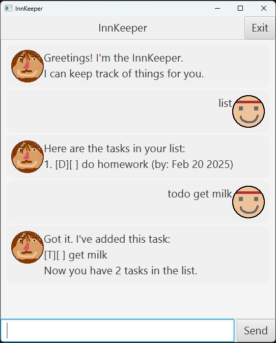

# InnKeeper User Guide




The innkeeper is a desktop app for managing your tasks.
It is optimized for use via a Command Line Interface (CLI) while still having the benefits of a Graphical User Interface (GUI).
If you can type fast, the Innkeeper can get your task management done faster than traditional GUI apps.

## Adding tasks

You can add 3 types of tasks.

1. TODO
This adds a generic task to your list.
Example: `todo (task description)`

2. DEADLINE
This adds a task with a deadline.
Example: `deadline (task description) /by (deadline)`
If your deadline is in the format `yyyy-mm-dd`, the Innkeeper will recognize it as a date, and parse it better.

3. EVENT
This adds a task with a start and end time.
Example: `event (task description) /from (start time) /to (end time)`
If your dates are in the format `yyyy-mm-dd`, the Innkeeper will recognize it as a date, and parse it better.

Sample output:
```
Got it. I've added this task:
{The task you added}
Now you have {number of tasks} tasks in the list.
```

## Listing tasks
You can list all your tasks using
`list`

Sample output:
```
Here are the tasks in your list:
1. {task 1}
2. {task 2}
...
```

## Mark / Unmark tasks as done

Innkeeper tracks if your tasks are done.
You can mark a task as done using
`mark (task number)`

You can unmark a task as done using
`unmark (task number)`


## Deleting tasks

You can delete a task using
`delete (task number)`


## Finding tasks
1. Normal find
You can find tasks that contain a specific keyword.
Example: `find (keyword)`


2. Fuzzy find
You can find tasks that partially match a keyword.
You will input a keyword and a percentage match, and the Innkeeper would find all tasks which contains at least that much percent of your keyword.
Example: `fuzzyfind (keyword) (percentage)`


## Close
To close the Innkeeper, you can click "Exit" in the top right corner.
Alternatively, you can type `bye` to close the Innkeeper.